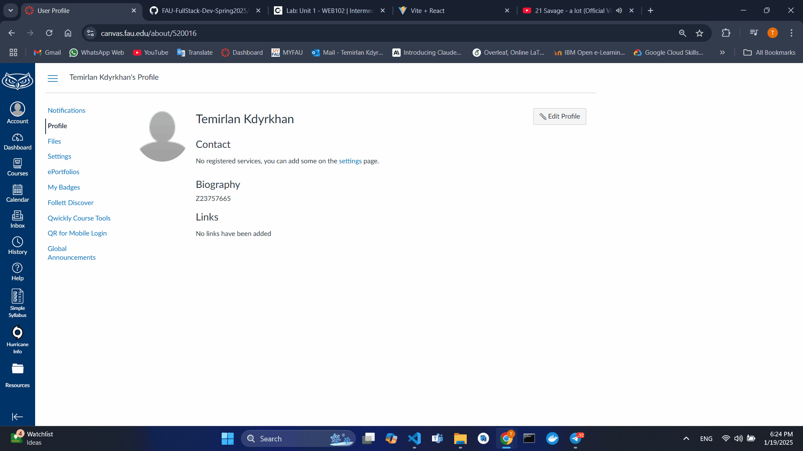

# Lab 1 - *Timetabled*

Submitted by: **Temirlan Kdyrkhan Z23757665**

**Timetabled** is a simple website project that demonstrates a grid-style calendar with one-hour events that plan out a single week.

Time spent: **4** hours spent in total

## Required Features

The following **required** functionality is completed:

* [X] A one-week calendar that includes one-hour time blocks
* [X] Events have different titles
* [X] Events have different colors based on their type
* [X] Event blocks have additional information, such as a description and location
* [X] Responsive design implementation
* [X] Enhanced styling and user interface
 
## GIF Walkthrough

Here's a walkthrough of implemented features:

<!-- Replace this with whatever GIF tool you used! -->
GIF created with ScreenToGif
<!-- Recommended tools:
[Kap](https://getkap.co/) for macOS
[ScreenToGif](https://www.screentogif.com/) for Windows
[peek](https://github.com/phw/peek) for Linux. -->

## Notes

Challenges and Learnings
Challenges:

* Implementation of correct architecture and logic of project
* Designing a responsive layout using CSS Flexbox and Grid.

## Learnings:

* Gained proficiency with Github Copilot.
* Learned breaking down complex UI into components, handling data flow between components.
* Debuged and troubleshooted React.
* Implemented responsive design principles.
* Developed skills in organizing code for readability and scalability.

## Technologies Used

* Frontend: Vite, React, JavaScript (ES6+).
* GitHub Copilot/ChatGPT: AI programming assistants.
* Development Tools: Visual Studio Code, Git/GitHub, Live Server plugin
* Workflow: Version control with Git, project setup and management with GitHub.

## License

    Copyright [2025] [TemirlanKN]

    Unless required by applicable law or agreed to in writing, software
    distributed under the License is distributed on an "AS IS" BASIS,
    WITHOUT WARRANTIES OR CONDITIONS OF ANY KIND, either express or implied.
    See the License for the specific language governing permissions and
    limitations under the License.
